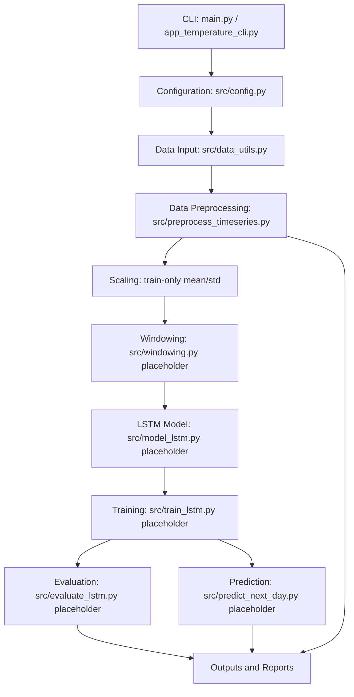
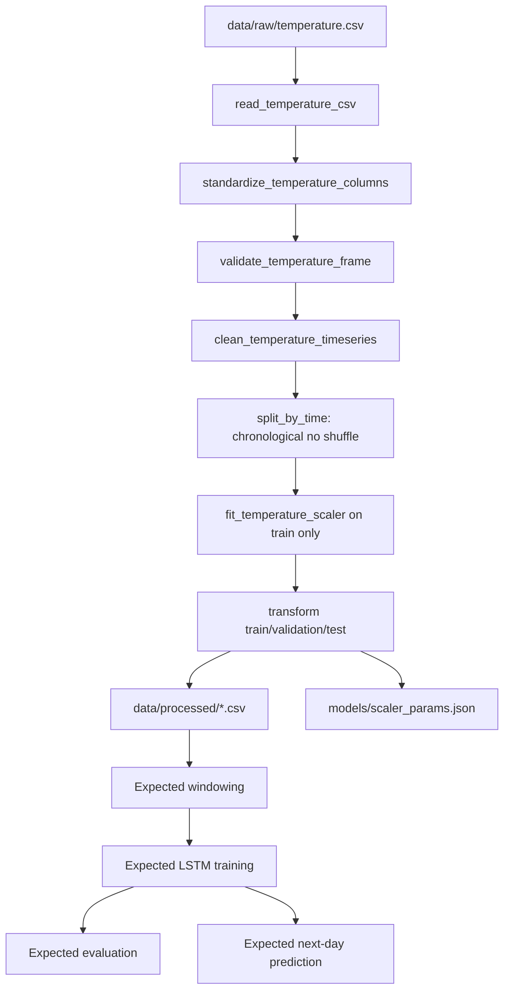
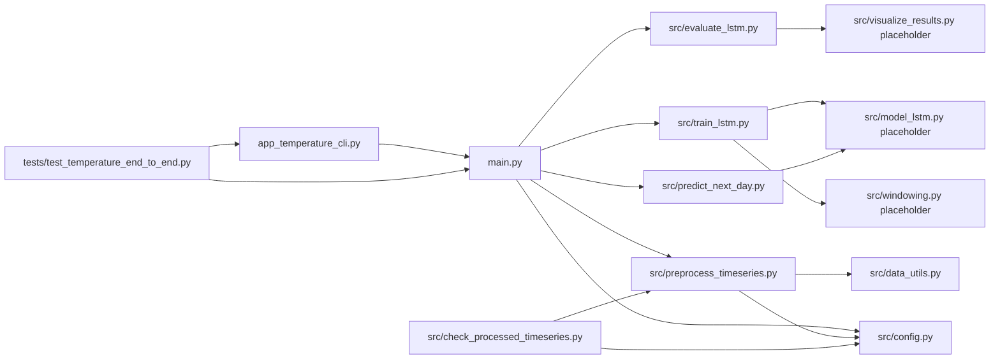

# Architecture Source Dossier for ChatGPT Web

## 1. Project Overview

**Project name:** `temperature_forecast`

**Course context:** Deep Learning practice project.

**Topic:** Predict next-day temperature using LSTM.

**Main goal:** Build a Python CLI-based workflow that reads a temperature time-series CSV, preprocesses it, prepares train/validation/test data in chronological order, and is intended to train/evaluate/predict with an LSTM model.

**Input data:** Temperature CSV located at `data/raw/temperature.csv`.

The existing data-reading code supports:

- Plain CSV with `date` and `temperature` columns.
- NASA POWER daily CSV with `YEAR,MO,DY,T2M`.
- NASA POWER daily CSV with `YEAR,DOY,T2M`.
- NASA POWER metadata headers before the table.

**Output prediction:** One next-day temperature value. The prediction flow is planned but not fully implemented in the current source because `src/predict_next_day.py` is still a placeholder.

**Main machine learning model:** LSTM with TensorFlow/Keras is the intended model. The current `src/model_lstm.py` file is still a placeholder and does not define a real architecture yet.

**Main technologies/libraries:**

- Python standard library: `argparse`, `importlib`, `json`, `math`, `pathlib`, `subprocess`, `sys`
- Pandas
- NumPy is listed in `requirements.txt`, but current implemented preprocessing code mainly uses Pandas.
- Matplotlib, scikit-learn, TensorFlow are listed in `requirements.txt` for the expected full ML pipeline, but current train/evaluate/model files are placeholders.

**Problem solved:** The implemented part solves the data preparation and project integration problem for next-day temperature forecasting: read raw temperature data, clean the time series, split chronologically, standardize using train-only statistics, save processed artifacts, and expose a CLI with readable checks. The actual LSTM training/evaluation/prediction layers are planned but incomplete.

## 2. Current Repository Structure

Current file tree, excluding `.git/` and generated cache files:

```text
temperature_forecast/
  .gitignore
  README.md
  app_temperature_cli.py
  main.py
  requirements.txt
  data/
    raw/
      .gitkeep
      README_data.md
      temperature.csv
    processed/
      .gitkeep
      README_processed.md
      split_info.json
      temperature_clean.csv
      temperature_scaled.csv
      temperature_test_scaled.csv
      temperature_train_scaled.csv
      temperature_val_scaled.csv
  docs/
    architecture_source_for_chatgpt.md
  models/
    .gitkeep
    README_models.md
    scaler_params.json
  reports/
    01_data_profile/
      .gitkeep
      clean_data_profile.json
      raw_data_profile.json
    02_training/
      .gitkeep
    03_evaluation/
      .gitkeep
    final_report/
      .gitkeep
      cleanup_summary.md
      submission_checklist.md
      test_log.txt
  src/
    __init__.py
    check_processed_timeseries.py
    config.py
    data_utils.py
    evaluate_lstm.py
    model_lstm.py
    predict_next_day.py
    preprocess_timeseries.py
    train_lstm.py
    visualize_results.py
    windowing.py
  tests/
    .gitkeep
    README_tests.md
    sample_temperature.csv
    test_temperature_end_to_end.py
```

### Important Folders and Files

| Path | Role |
|---|---|
| `main.py` | Main CLI entry point. Supports `self_test`, `preprocess`, `train`, `evaluate`, `predict_next_day`, `run_all`. Uses safe imports and readable errors. |
| `app_temperature_cli.py` | Thin student-friendly wrapper around `main.py`. Prints help if no command is provided. |
| `src/config.py` | Central configuration: project paths, raw/processed data paths, model/scaler paths, report paths, column names, split ratios, window size, training hyperparameters. |
| `src/data_utils.py` | Real implemented data input module. Reads raw CSV, detects NASA metadata, standardizes date/temperature columns, validates data, builds data profiles. |
| `src/preprocess_timeseries.py` | Real implemented preprocessing module. Cleans daily time series, fills missing days, splits by time, fits train-only scaler, transforms splits, saves artifacts. |
| `src/check_processed_timeseries.py` | Real implemented validation helper for processed data artifacts. Checks required files, columns, chronological data, split labels, and scaler parameters. |
| `src/windowing.py` | Placeholder only. Currently contains `main_test_windowing()` and does not create LSTM windows. |
| `src/model_lstm.py` | Placeholder only. Currently contains `main_test_temperature_lstm_build()` and does not define a TensorFlow/Keras model. |
| `src/train_lstm.py` | Placeholder only. Currently contains `main_test_train_lstm()` and does not train or save a model. |
| `src/evaluate_lstm.py` | Placeholder only. Currently contains `main_test_temperature_evaluate_predict()` and does not compute MAE/MSE/RMSE. |
| `src/predict_next_day.py` | Placeholder only. Currently contains `main_test_predict_next_day()` and does not predict next-day temperature. |
| `src/visualize_results.py` | Placeholder only. Currently contains `main_test_visualize_results()` and does not create figures. |
| `data/raw/` | Holds raw input CSV. `temperature.csv` is present. |
| `data/processed/` | Holds preprocessing outputs created by `preprocess_temperature_pipeline()`. Several CSV/JSON artifacts are present. |
| `models/` | Holds model/scaler artifacts. `scaler_params.json` is present; `temp_lstm.keras` is expected by config but missing. |
| `outputs/figures/`, `outputs/metrics/`, `outputs/logs/` | Not present in current repository. Current code writes to `reports/` and `data/processed/`, not `outputs/`. |
| `reports/` | Holds data profiles and final submission documents. Training/evaluation report folders exist but only contain `.gitkeep`. |
| `tests/` | Holds a lightweight acceptance test script and sample CSV. |

## 3. System Architecture by Layers

### Layer 1: CLI / Application Entry Layer

**Responsibility:** Provide runnable commands, route commands to the correct module, check missing data/model conditions, and show readable errors.

**Related files:**

- `main.py`
- `app_temperature_cli.py`

**Important functions:**

- `main.build_parser()`
- `main.main()`
- `main.self_test()`
- `main.preprocess()`
- `main.train()`
- `main.evaluate()`
- `main.predict_next_day()`
- `main.run_all()`
- `app_temperature_cli.app_main()`

**Input:** CLI command such as `python main.py preprocess`.

**Output:** Console messages and, for commands with real implementation, saved data artifacts.

**Connection to next layer:** CLI imports `src.config` and dynamically imports pipeline modules such as `src.preprocess_timeseries`.

### Layer 2: Configuration Layer

**Responsibility:** Define shared paths, column names, split ratios, window size, and training parameters.

**Related file:** `src/config.py`

**Important values:**

- `DATA_RAW_PATH = data/raw/temperature.csv`
- `CLEAN_DATA_PATH = data/processed/temperature_clean.csv`
- `TRAIN_SCALED_PATH = data/processed/temperature_train_scaled.csv`
- `VAL_SCALED_PATH = data/processed/temperature_val_scaled.csv`
- `TEST_SCALED_PATH = data/processed/temperature_test_scaled.csv`
- `FULL_SCALED_PATH = data/processed/temperature_scaled.csv`
- `MODEL_PATH = models/temp_lstm.keras`
- `SCALER_PARAMS_PATH = models/scaler_params.json`
- `DATE_COL = "date"`
- `TEMP_COL = "temperature"`
- `WINDOW_SIZE = 7`
- `HORIZON = 1`
- `TRAIN_RATIO = 0.7`
- `VAL_RATIO = 0.15`
- `BATCH_SIZE = 32`
- `EPOCHS = 10`
- `LEARNING_RATE = 0.001`

**Input:** None at runtime except Python imports.

**Output:** Constants used by all pipeline layers.

**Connection to next layer:** Data input/preprocessing modules import these constants instead of hard-coding paths.

### Layer 3: Data Input Layer

**Responsibility:** Read raw CSV and normalize schema into canonical date/temperature columns.

**Related files:**

- `data/raw/temperature.csv`
- `src/data_utils.py`

**Important functions:**

- `_detect_skiprows_for_nasa_csv()`
- `read_temperature_csv()`
- `_find_column_case_insensitive()`
- `standardize_temperature_columns()`
- `validate_temperature_frame()`
- `load_temperature_data()`

**Input:** Raw CSV. Supported columns include `date`, `temperature`, NASA `YEAR`, `MO`, `DY`, `DOY`, `T2M`, `T2M_MAX`, `T2M_MIN`.

**Output:** Pandas DataFrame with canonical `date` and `temperature` columns.

**Connection to next layer:** `preprocess_temperature_pipeline()` calls `load_temperature_data()`.

### Layer 4: Data Preprocessing Layer

**Responsibility:** Clean daily time series, normalize dates, sort by time, aggregate duplicate dates, fill missing days/values, and split chronologically.

**Related file:** `src/preprocess_timeseries.py`

**Important functions:**

- `clean_temperature_timeseries()`
- `split_by_time()`
- `_date_range_info()`
- `build_split_info()`
- `preprocess_temperature_pipeline()`

**Input:** DataFrame from `load_temperature_data()`.

**Output:**

- Clean DataFrame
- `data/processed/temperature_clean.csv`
- Train/validation/test DataFrames
- `data/processed/split_info.json`

**Connection to next layer:** The cleaned splits are passed to scaling functions in the same module.

### Layer 5: Scaling / Transformation Layer

**Responsibility:** Fit mean/std standardization parameters on train only, transform train/validation/test using train parameters, and save scaler metadata.

**Related file:** `src/preprocess_timeseries.py`

**Important functions:**

- `fit_temperature_scaler()`
- `transform_temperature()`
- `inverse_transform_temperature()`
- `scale_time_splits()`
- `save_json()`
- `load_scaler_params()`

**Input:** Chronological train/validation/test splits.

**Output:**

- `temperature_train_scaled.csv`
- `temperature_val_scaled.csv`
- `temperature_test_scaled.csv`
- `temperature_scaled.csv`
- `models/scaler_params.json`

**Data leakage prevention:** `fit_temperature_scaler()` uses only `train_df`. Validation/test are transformed using train mean/std.

**Connection to next layer:** The scaled time series should feed the windowing layer. That layer is currently incomplete.

### Layer 6: Windowing Layer

**Responsibility:** Intended to convert a univariate time series into supervised LSTM samples.

**Related file:** `src/windowing.py`

**Current implementation:** Placeholder only.

**Existing function:** `main_test_windowing()`

**Expected input:** Scaled temperature series, likely from `temperature_train_scaled.csv`, `temperature_val_scaled.csv`, `temperature_test_scaled.csv`.

**Expected output:** LSTM windows:

- `X` shape should be conceptually `(samples, WINDOW_SIZE, features)`.
- `y` shape should be conceptually `(samples,)` or `(samples, 1)`.
- With `WINDOW_SIZE = 7` and `HORIZON = 1`, the target should be the next-day value after each 7-day window.

**Important limitation:** No actual window creation function exists in current code.

### Layer 7: Model Layer

**Responsibility:** Intended to define the TensorFlow/Keras LSTM architecture.

**Related file:** `src/model_lstm.py`

**Current implementation:** Placeholder only.

**Existing function:** `main_test_temperature_lstm_build()`

**Expected input:** LSTM input shape such as `(WINDOW_SIZE, features)`.

**Expected output:** Compiled Keras model.

**Missing architecture details:** Current source does not define LSTM units, Dense layers, Dropout, optimizer, loss, or metrics. Do not invent these values in final analysis.

### Layer 8: Training Layer

**Responsibility:** Intended to train the LSTM model and save model/history artifacts.

**Related file:** `src/train_lstm.py`

**Current implementation:** Placeholder only.

**Existing function:** `main_test_train_lstm()`

**CLI behavior:** `python main.py train` looks for one of these functions in `src.train_lstm`:

- `train_lstm_pipeline`
- `train_temperature_lstm`
- `train_model`
- `train`

None of these exists currently, so the CLI will report a missing implementation function if processed data is present.

**Expected output:** Current config expects the model path `models/temp_lstm.keras`. No training history output path is implemented in code.

### Layer 9: Evaluation Layer

**Responsibility:** Intended to load the trained model, predict on test windows, inverse-transform predictions, calculate metrics, and save evaluation artifacts.

**Related file:** `src/evaluate_lstm.py`

**Current implementation:** Placeholder only.

**Existing function:** `main_test_temperature_evaluate_predict()`

**CLI behavior:** `python main.py evaluate` first checks processed data and `models/temp_lstm.keras`. Since model is missing, the command stops with a readable missing-model error before looking for evaluate implementation.

**Expected metrics:** MAE, MSE, RMSE. No actual metric calculation code exists currently.

### Layer 10: Prediction Layer

**Responsibility:** Intended to predict next-day temperature from the latest available window.

**Related file:** `src/predict_next_day.py`

**Current implementation:** Placeholder only.

**Existing function:** `main_test_predict_next_day()`

**CLI behavior:** `python main.py predict_next_day` checks processed data and `models/temp_lstm.keras`. Since model is missing, it stops with a readable missing-model error.

**Expected flow:** Load scaler params, take latest `WINDOW_SIZE` days, scale input, reshape for LSTM, call `model.predict`, inverse-transform prediction, print/save predicted date/value. This expected flow is not implemented yet.

### Layer 11: Output / Report Layer

**Responsibility:** Store generated artifacts and final submission evidence.

**Related folders:**

- `data/processed/`
- `models/`
- `reports/01_data_profile/`
- `reports/02_training/`
- `reports/03_evaluation/`
- `reports/final_report/`

**Existing outputs:**

- Processed CSV files in `data/processed/`
- `models/scaler_params.json`
- Data profile JSON files in `reports/01_data_profile/`
- Final submission documents in `reports/final_report/`

**Missing outputs:**

- `models/temp_lstm.keras`
- Training history file
- Training figures
- Evaluation metrics
- Test predictions
- Evaluation figures

**Note:** The requested `outputs/figures/`, `outputs/metrics/`, and `outputs/logs/` folders are not present and are not used by current code.

### Layer 12: Test / Acceptance Layer

**Responsibility:** Provide lightweight checks for folder structure, CLI behavior, missing-model messages, and no absolute paths in CLI files.

**Related files:**

- `tests/test_temperature_end_to_end.py`
- `tests/sample_temperature.csv`

**Important functions:**

- `run_command()`
- `assert_true()`
- `test_required_folders()`
- `test_self_test_runs()`
- `test_app_wrapper_runs()`
- `test_cli_argument_validation()`
- `test_evaluate_missing_model_message()`
- `test_no_absolute_paths_required_in_cli_files()`
- `main()`

**What is tested:**

- Required folders exist or can be created.
- `main.py self_test` exits successfully without traceback.
- `app_temperature_cli.py self_test` works.
- Invalid CLI commands are rejected.
- Missing model message is readable.
- CLI files do not contain obvious local Windows absolute paths.

**What is not tested:**

- Real LSTM training.
- Real evaluation metrics.
- Real next-day prediction.
- Numerical correctness of preprocessing.
- TensorFlow/Keras model behavior.

## 4. Full Data Pipeline

| Step | Input file/data | Processing function/file | Output file/data | Notes or risks |
|---|---|---|---|---|
| Step 1: User places `temperature.csv` into `data/raw/` | `data/raw/temperature.csv` | Manual setup | Raw CSV available | File exists in current repo. |
| Step 2: CLI calls preprocessing command | CLI command `python main.py preprocess` | `main.preprocess()` | Calls preprocessing function | Requires raw CSV. |
| Step 3: System reads CSV | Raw CSV | `src.data_utils.read_temperature_csv()` | Raw DataFrame | Handles NASA metadata by skiprows detection. |
| Step 4: System parses date column | Raw DataFrame | `standardize_temperature_columns()` and Pandas `to_datetime` | Canonical `date` column | Supports `date`, `YEAR/MO/DY`, or `YEAR/DOY`. |
| Step 5: System sorts by chronological order | Canonical DataFrame | `clean_temperature_timeseries()` | Sorted daily DataFrame | Duplicate days are grouped by mean. |
| Step 6: System cleans missing/invalid temperature values | Sorted DataFrame | `clean_temperature_timeseries()` | Clean DataFrame | `-999` is treated as missing; values filled by interpolation by default. |
| Step 7: System splits train/validation/test without shuffle | Clean DataFrame | `split_by_time()` | `train_df`, `val_df`, `test_df` | Prevents future data entering train through shuffle. |
| Step 8: System fits scaler on train only | `train_df` | `fit_temperature_scaler()` | `{"mean", "std"}` | Important data leakage prevention. |
| Step 9: System transforms all sets using train scaler | Splits + scaler params | `scale_time_splits()` and `transform_temperature()` | Scaled split DataFrames | Same mean/std applied to validation/test. |
| Step 10: System creates LSTM windows | Scaled split DataFrames | Expected `src/windowing.py` | Expected `X_train`, `y_train`, etc. | Not implemented; current file is placeholder. |
| Step 11: System trains LSTM | Windowed train/validation data | Expected `src/train_lstm.py` | Expected trained model | Not implemented; no `model.fit` exists. |
| Step 12: System saves model and history | Trained model/history | Expected training module | Expected `models/temp_lstm.keras` and history file | Model file missing; history path not implemented. |
| Step 13: System evaluates model | Trained model + test windows | Expected `src/evaluate_lstm.py` | Expected predictions/metrics | Not implemented. |
| Step 14: System inverse-transforms predictions | Scaled predictions | `inverse_transform_temperature()` expected to be reused | Temperatures in original unit | Function exists, but evaluation/prediction modules do not use it yet. |
| Step 15: System calculates MAE, MSE, RMSE | Original-scale y_true/y_pred | Expected evaluation module | Expected metric file | Not implemented. |
| Step 16: System saves metrics and figures | Metrics/history/predictions | Expected evaluation/visualization modules | Expected report artifacts | Not implemented; `visualize_results.py` is placeholder. |
| Step 17: System predicts next-day temperature from latest window | Latest scaled window | Expected `src/predict_next_day.py` | Predicted next-day temperature | Not implemented; model file missing. |

## 5. Function-Level Mapping Table

Only functions/classes that actually exist in the repository are listed.

| File | Function/Class | Purpose | Input | Output | Called by | Calls next | Notes |
|---|---|---|---|---|---|---|---|
| `main.py` | `CliError` | Custom readable CLI exception | Error message | Exception object | CLI guard functions | `main()` catches it | Does not expose traceback to user. |
| `main.py` | `rel_path()` | Convert path to project-relative display | Path | String path | Error messages, self_test | Path operations | Helps avoid absolute local paths in output. |
| `main.py` | `safe_import()` | Import module safely | Module name | Module or None | `self_test()`, `find_callable()` | `importlib.import_module()` | Prints missing dependency/import errors. |
| `main.py` | `find_callable()` | Find real implementation function | Module name, candidate names | Callable | CLI command functions | `safe_import()` | Raises `CliError` if implementation missing. |
| `main.py` | `ensure_raw_data_exists()` | Check raw CSV exists | None | None or error | `preprocess()` | `rel_path()` | Requires `data/raw/temperature.csv`. |
| `main.py` | `ensure_processed_data_exists()` | Check preprocessing artifacts exist | None | None or error | `train()`, `evaluate()`, `predict_next_day()` | `rel_path()` | Requires processed CSV/JSON files. |
| `main.py` | `ensure_model_exists()` | Check trained model exists | None | None or error | `evaluate()`, `predict_next_day()` | `rel_path()` | Requires `models/temp_lstm.keras`. |
| `main.py` | `check_placeholder_module()` | Detect placeholder modules | Module name | Status string | `self_test()` | File read | Uses text markers `placeholder` or `main_test_`. |
| `main.py` | `self_test()` | Check project structure and imports | None | Exit code 0 | CLI | `safe_import()`, `check_placeholder_module()` | Reports missing pandas/model but still completes. |
| `main.py` | `preprocess()` | Run preprocessing pipeline | Raw CSV | Processed data artifacts | CLI | `find_callable()` | Calls `preprocess_temperature_pipeline()` if import succeeds. |
| `main.py` | `train()` | Run training pipeline | Processed data | Expected model/history | CLI, `run_all()` | `find_callable()` | No matching real train function exists. |
| `main.py` | `evaluate()` | Run evaluation pipeline | Processed data + model | Expected metrics | CLI, `run_all()` | `ensure_model_exists()` | Stops if model missing. |
| `main.py` | `predict_next_day()` | Run next-day prediction | Processed data + model | Expected prediction | CLI, `run_all()` | `ensure_model_exists()` | Stops if model missing. |
| `main.py` | `run_all()` | Run full pipeline order | Raw CSV | Full expected pipeline | CLI | `preprocess()`, `train()`, `evaluate()`, `predict_next_day()` | Will fail at incomplete stages. |
| `main.py` | `build_parser()` | Build CLI parser | None | `ArgumentParser` | `main()`, `app_main()` | argparse | Supports actual command list. |
| `main.py` | `main()` | CLI entrypoint | argv | Status code | `if __main__`, `app_main()` | `COMMANDS` | Handles errors cleanly. |
| `app_temperature_cli.py` | `app_main()` | Friendly wrapper around main CLI | argv | Status code | `if __main__` | `build_parser()`, `main()` | Prints help when no command. |
| `src.data_utils.py` | `_detect_skiprows_for_nasa_csv()` | Detect metadata rows in NASA CSV | CSV path | skiprows int | `read_temperature_csv()` | File read | Stops scan after 200 lines. |
| `src.data_utils.py` | `read_temperature_csv()` | Read raw temperature CSV | CSV path | DataFrame | `load_temperature_data()` | `_detect_skiprows_for_nasa_csv()`, `pd.read_csv()` | Raises FileNotFoundError if missing. |
| `src.data_utils.py` | `_find_column_case_insensitive()` | Find column ignoring case | DataFrame, candidates | Column name or None | `standardize_temperature_columns()` | None | Used for flexible input schema. |
| `src.data_utils.py` | `standardize_temperature_columns()` | Convert input schema to `date`/`temperature` | DataFrame | Canonical DataFrame | `load_temperature_data()` | `_find_column_case_insensitive()`, Pandas datetime | Supports NASA and plain CSV. |
| `src.data_utils.py` | `validate_temperature_frame()` | Validate minimum schema/data | DataFrame | None or error | `load_temperature_data()`, `profile_temperature_data()` | Pandas parsing | Rejects empty/invalid data. |
| `src.data_utils.py` | `load_temperature_data()` | Read, standardize, validate | CSV path | Canonical DataFrame | `preprocess_temperature_pipeline()` | `read_temperature_csv()`, `standardize_temperature_columns()`, `validate_temperature_frame()` | Main data input function. |
| `src.data_utils.py` | `profile_temperature_data()` | Build compact data profile | DataFrame | dict | `preprocess_temperature_pipeline()`, test helper | `validate_temperature_frame()` | Saves rows, missing counts, date range, min/max/mean. |
| `src.data_utils.py` | `save_data_profile()` | Save profile JSON | dict, output path | JSON file | Not currently called by pipeline | Path write | Similar save behavior is implemented through `save_json()`. |
| `src.data_utils.py` | `main_test_temperature_data_pipeline()` | Quick sample test | Sample CSV | Console output | Direct execution | `load_temperature_data()`, `profile_temperature_data()` | Not used by main CLI. |
| `src.preprocess_timeseries.py` | `clean_temperature_timeseries()` | Clean daily time series | Canonical DataFrame | Clean DataFrame | `preprocess_temperature_pipeline()` | Pandas cleaning/interpolation | Handles `-999`, duplicate dates, missing days. |
| `src.preprocess_timeseries.py` | `split_by_time()` | Chronological train/val/test split | Clean DataFrame | Three DataFrames | `preprocess_temperature_pipeline()` | Pandas slicing | No shuffle; avoids future leakage. |
| `src.preprocess_timeseries.py` | `_date_range_info()` | Summarize split date range | DataFrame | dict | `build_split_info()` | Pandas datetime | Records rows/start/end. |
| `src.preprocess_timeseries.py` | `build_split_info()` | Build split metadata | train/val/test DataFrames | dict | `preprocess_temperature_pipeline()` | `_date_range_info()` | Writes `chronological_no_shuffle`. |
| `src.preprocess_timeseries.py` | `fit_temperature_scaler()` | Fit standard scaler params on train | train DataFrame | dict | `scale_time_splits()` | Pandas numeric stats | Avoids data leakage. |
| `src.preprocess_timeseries.py` | `transform_temperature()` | Apply train-fitted scaling | DataFrame, scaler params | DataFrame with scaled column | `scale_time_splits()` | Pandas arithmetic | Adds `temperature_scaled`. |
| `src.preprocess_timeseries.py` | `inverse_transform_temperature()` | Convert scaled values to original units | values, scaler params | original-scale values | Expected evaluate/predict future use | Arithmetic | Currently not called by placeholder modules. |
| `src.preprocess_timeseries.py` | `scale_time_splits()` | Scale all splits | train/val/test DataFrames | scaled splits + scaler params | `preprocess_temperature_pipeline()` | `fit_temperature_scaler()`, `transform_temperature()` | Fits train only. |
| `src.preprocess_timeseries.py` | `save_json()` | Save dict as JSON | dict, output path | JSON file | `preprocess_temperature_pipeline()` | Path write | Used for split/scaler/profile files. |
| `src.preprocess_timeseries.py` | `load_scaler_params()` | Load scaler params | JSON path | dict | Not currently called by placeholder modules | Path read/json | Expected prediction/evaluation helper. |
| `src.preprocess_timeseries.py` | `preprocess_temperature_pipeline()` | Full preprocessing pipeline | CSV path | dict + saved artifacts | `main.preprocess()`, direct `main()` | All preprocessing helpers | Main implemented ML-prep pipeline. |
| `src.preprocess_timeseries.py` | `main()` | Direct preprocessing entrypoint | None | Console output + artifacts | Direct execution | `preprocess_temperature_pipeline()` | Separate from project CLI. |
| `src.check_processed_timeseries.py` | `_require_file()` | Require a file exists | Path | None or error | `check_processed_timeseries()` | Path exists | Validates preprocessing artifacts. |
| `src.check_processed_timeseries.py` | `_check_csv()` | Read CSV and validate columns | Path, required columns | DataFrame | `check_processed_timeseries()` | `pd.read_csv()` | Checks empty files. |
| `src.check_processed_timeseries.py` | `check_processed_timeseries()` | Validate processed artifacts | None | Console output or error | Direct execution | `_require_file()`, `_check_csv()` | Confirms split and scaler metadata. |
| `src.windowing.py` | `main_test_windowing()` | Placeholder check | None | Console output | Direct execution, self_test text detection | None | No real windowing logic. |
| `src.model_lstm.py` | `main_test_temperature_lstm_build()` | Placeholder check | None | Console output | Direct execution, self_test text detection | None | No real Keras model. |
| `src.train_lstm.py` | `main_test_train_lstm()` | Placeholder check | None | Console output | Direct execution, self_test text detection | None | No `model.fit`. |
| `src.evaluate_lstm.py` | `main_test_temperature_evaluate_predict()` | Placeholder check | None | Console output | Direct execution, self_test text detection | None | No MAE/MSE/RMSE. |
| `src.predict_next_day.py` | `main_test_predict_next_day()` | Placeholder check | None | Console output | Direct execution, self_test text detection | None | No `model.predict`. |
| `src.visualize_results.py` | `main_test_visualize_results()` | Placeholder check | None | Console output | Direct execution | None | No figures. |
| `tests/test_temperature_end_to_end.py` | `run_command()` | Run Python command in project root | args | CompletedProcess | Test functions | `subprocess.run()` | Captures output. |
| `tests/test_temperature_end_to_end.py` | `assert_true()` | Minimal assertion helper | condition, message | None or AssertionError | Test functions | None | Avoids requiring pytest. |
| `tests/test_temperature_end_to_end.py` | `test_required_folders()` | Check folders exist/can be created | None | None | test `main()` | `assert_true()` | Creates missing folders if needed. |
| `tests/test_temperature_end_to_end.py` | `test_self_test_runs()` | Check main self_test | None | None | test `main()` | `run_command()` | Ensures no traceback. |
| `tests/test_temperature_end_to_end.py` | `test_app_wrapper_runs()` | Check wrapper self_test | None | None | test `main()` | `run_command()` | Ensures wrapper works. |
| `tests/test_temperature_end_to_end.py` | `test_cli_argument_validation()` | Check invalid CLI rejected | None | None | test `main()` | `run_command()` | Uses argparse invalid choice. |
| `tests/test_temperature_end_to_end.py` | `test_evaluate_missing_model_message()` | Check missing model message | None | None | test `main()` | `run_command()` | Only asserts if model missing. |
| `tests/test_temperature_end_to_end.py` | `test_no_absolute_paths_required_in_cli_files()` | Check CLI files do not hard-code local paths | None | None | test `main()` | File read | Scans for `C:\` or `D:\`. |
| `tests/test_temperature_end_to_end.py` | `main()` | Run all acceptance tests | None | status code | Direct execution | All test functions | Does not require pytest. |

## 6. CLI Command Mapping

| Command | File/function triggered | Required input | Generated output | When to use | Possible error if missing data/model |
|---|---|---|---|---|---|
| `python main.py self_test` | `main.py` -> `self_test()` | Repository files/folders | Console status report | Before submission or debugging setup | Reports missing dependencies/model as readable notices; returns 0 if self-test completes. |
| `python main.py preprocess` | `main.py` -> `preprocess()` -> `src.preprocess_timeseries.preprocess_temperature_pipeline()` | `data/raw/temperature.csv`, Pandas installed | Processed CSVs, `split_info.json`, `scaler_params.json`, data profile JSONs | After placing raw CSV | Missing raw CSV; missing Pandas causes import error caught by CLI. |
| `python main.py train` | `main.py` -> `train()` -> expected train function in `src.train_lstm` | Processed CSV/JSON artifacts | Expected model/history, but not implemented | After preprocessing and after training module is implemented | Missing processed data; missing implementation function. |
| `python main.py evaluate` | `main.py` -> `evaluate()` -> expected evaluate function in `src.evaluate_lstm` | Processed data + `models/temp_lstm.keras` | Expected metrics/predictions, but not implemented | After real training | Missing model currently stops command. |
| `python main.py predict_next_day` | `main.py` -> `predict_next_day()` -> expected predict function in `src.predict_next_day` | Processed data + `models/temp_lstm.keras` | Expected next-day prediction, but not implemented | After real training | Missing model currently stops command. |
| `python main.py run_all` | `main.py` -> `run_all()` | Raw CSV plus all later implementations | Full expected pipeline | End-to-end run after all modules are complete | Will fail at missing dependency/model/function depending on stage. |
| `python app_temperature_cli.py self_test` | `app_temperature_cli.py` -> `app_main()` -> `main.main()` | Same as main CLI | Same as main CLI | Student-friendly wrapper | Same as main CLI. |

## 7. Data Artifact Mapping

Only artifacts present or expected by actual code/config are included.

| Artifact | Path | Created by | Used by | Meaning |
|---|---|---|---|---|
| Raw temperature CSV | `data/raw/temperature.csv` | User/manual data placement | `read_temperature_csv()`, `preprocess_temperature_pipeline()` | Original time-series data. Present. |
| Clean temperature CSV | `data/processed/temperature_clean.csv` | `preprocess_temperature_pipeline()` | `check_processed_timeseries()`, expected training/windowing | Clean daily temperature series. Present. |
| Train scaled CSV | `data/processed/temperature_train_scaled.csv` | `preprocess_temperature_pipeline()` | `check_processed_timeseries()`, expected training/windowing | Chronological train split with `temperature_scaled`. Present. |
| Validation scaled CSV | `data/processed/temperature_val_scaled.csv` | `preprocess_temperature_pipeline()` | `check_processed_timeseries()`, expected validation | Chronological validation split. Present. |
| Test scaled CSV | `data/processed/temperature_test_scaled.csv` | `preprocess_temperature_pipeline()` | `check_processed_timeseries()`, expected evaluation | Chronological test split. Present. |
| Full scaled CSV | `data/processed/temperature_scaled.csv` | `preprocess_temperature_pipeline()` | `check_processed_timeseries()` | All scaled rows with split labels. Present. |
| Split info | `data/processed/split_info.json` | `build_split_info()` via `preprocess_temperature_pipeline()` | `check_processed_timeseries()` | Stores split ratios, row counts, date ranges, and `chronological_no_shuffle`. Present. |
| Scaler params | `models/scaler_params.json` | `fit_temperature_scaler()` via `preprocess_temperature_pipeline()` | `load_scaler_params()`, expected evaluate/predict | Stores train mean/std for scaling/inverse-scaling. Present. |
| Raw data profile | `reports/01_data_profile/raw_data_profile.json` | `profile_temperature_data()` via `preprocess_temperature_pipeline()` | Reports/final documentation | Summary of raw data. Present. |
| Clean data profile | `reports/01_data_profile/clean_data_profile.json` | `profile_temperature_data()` via `preprocess_temperature_pipeline()` | Reports/final documentation | Summary of cleaned data. Present. |
| Model file | `models/temp_lstm.keras` | Expected training module | `ensure_model_exists()`, expected evaluate/predict | Trained LSTM model. Missing. |
| Training history | Not configured in current code | Expected training module | Expected reports | Missing; no path in config. |
| Regression metrics | Not configured in current code | Expected evaluation module | Expected reports | Missing; no path in config. |
| Test predictions | Not configured in current code | Expected evaluation module | Expected reports | Missing; no path in config. |
| Training figure | Not configured in current code | Expected visualization/training module | Expected reports | Missing; no path in config. |
| Actual vs predicted figure | Not configured in current code | Expected evaluation/visualization module | Expected reports | Missing; no path in config. |
| Submission checklist | `reports/final_report/submission_checklist.md` | Manual/project integration | Final report | Tracks completion status. Present. |
| Test log | `reports/final_report/test_log.txt` | Manual/project integration | Final report | Records validation and missing artifacts. Present. |
| Cleanup summary | `reports/final_report/cleanup_summary.md` | Manual/project integration | Final report | Explains cleanup decisions. Present. |

## 8. Model Architecture Explanation

### What can be stated from current source

The project is intended to use an LSTM model for next-day temperature forecasting, but the current `src/model_lstm.py` does not define a real model. Therefore, the exact architecture is unknown from source code.

Known configuration values that would likely affect the model:

- `WINDOW_SIZE = 7`
- `HORIZON = 1`
- `BATCH_SIZE = 32`
- `EPOCHS = 10`
- `LEARNING_RATE = 0.001`
- `MODEL_PATH = models/temp_lstm.keras`

### General LSTM explanation for this project context

LSTM is appropriate for time-series forecasting because it is designed to learn temporal dependencies from ordered sequences. In this project, the intended input sequence is a rolling window of recent temperature values, and the target is the next-day temperature.

Expected input shape after windowing:

```text
(samples, WINDOW_SIZE, features)
```

For a univariate temperature series, `features` would usually be `1`, so with `WINDOW_SIZE = 7`, each sample would represent 7 consecutive days of scaled temperature.

Expected output shape:

```text
(samples, 1)
```

or a one-dimensional `(samples,)` target depending on implementation.

### Missing architecture details

The source code does not currently specify:

- LSTM units
- Number of LSTM layers
- Dense layer structure
- Dropout
- Loss function
- Metrics
- Optimizer
- `model.compile()`
- `model.fit()`
- `model.predict()`

### Inverse transformation

The function `inverse_transform_temperature(values, scaler_params)` exists in `src/preprocess_timeseries.py`. It converts standardized predictions back to the original temperature unit:

```text
original_value = scaled_value * std + mean
```

This should be used in future evaluation and prediction modules, but current placeholder files do not call it.

No performance values should be reported because no real training/evaluation result exists in the source.

## 9. Data Leakage Prevention

### Existing protections in current code

1. **Chronological split:** `split_by_time()` sorts by `DATE_COL` and slices train/validation/test in order.

2. **No shuffle:** `split_info.json` records `split_rule = "chronological_no_shuffle"`. `check_processed_timeseries()` validates this.

3. **Scaler fit on train only:** `fit_temperature_scaler()` receives `train_df` only. `scale_time_splits()` fits scaler on train, then transforms validation/test using the same params.

4. **Saved scaler metadata:** `models/scaler_params.json` stores train mean/std, allowing future evaluate/predict modules to use the same scaling.

### Possible risks or limitations

1. **Interpolation may use future values inside the full cleaned series:** `clean_temperature_timeseries()` uses `interpolate(method="linear", limit_direction="both")` before splitting. Linear interpolation can use values on both sides of a missing point. This is acceptable for many data-cleaning workflows, but for strict forecasting evaluation it can be considered a leakage risk if missing values in train are interpolated using future validation/test data. A safer course-scope improvement would be to split first or restrict imputation to past-only methods where required.

2. **Windowing not implemented:** Since no real windowing exists, there is not yet code enforcing that prediction windows avoid future target values.

3. **Evaluation/prediction not implemented:** There is no current code proving that inverse transformation, metric calculation, and prediction window selection are leakage-safe.

4. **Model file missing:** `models/temp_lstm.keras` is absent, so no real model evaluation can be audited.

## 10. Mermaid Diagrams

### Diagram 1: System Architecture



### Diagram 2: Data Pipeline



### Diagram 3: File / Layer Dependency



## 11. Strengths and Limitations

### Current strengths

- Clear CLI integration with readable error messages.
- Uses `pathlib` and relative project paths through `src/config.py`.
- Supports multiple raw CSV formats, including NASA POWER formats.
- Validates input data before preprocessing.
- Cleans and sorts data chronologically.
- Splits train/validation/test without shuffle.
- Fits standardization parameters on train only.
- Saves processed artifacts and profiles for reporting.
- Includes lightweight acceptance tests that do not require pytest.
- Documents missing model and placeholder modules rather than fabricating results.

### Current limitations

- `src/windowing.py` is placeholder; no supervised learning windows are created.
- `src/model_lstm.py` is placeholder; no TensorFlow/Keras LSTM architecture exists.
- `src/train_lstm.py` is placeholder; no `model.fit`, model saving, or training history exists.
- `src/evaluate_lstm.py` is placeholder; no MAE/MSE/RMSE calculation exists.
- `src/predict_next_day.py` is placeholder; no actual next-day prediction exists.
- `src/visualize_results.py` is placeholder; no figures are generated.
- `models/temp_lstm.keras` is missing.
- No configured paths exist for training history, regression metrics, predictions, or figures.
- `outputs/` folder requested in some architecture templates is not used by current code.
- Current environment used by self-test is missing `pandas`, so implemented data modules cannot import there until dependencies are installed.

### Suggestions within course scope

- Implement `create_windows()` or equivalent in `src/windowing.py`.
- Implement a simple LSTM regression model in `src/model_lstm.py` using the configured `WINDOW_SIZE` and `LEARNING_RATE`.
- Implement `train_lstm_pipeline()` in `src/train_lstm.py` to load scaled splits, create windows, train with validation, and save `models/temp_lstm.keras`.
- Add configured report paths for history, metrics, predictions, and figures.
- Implement `evaluate_lstm_pipeline()` to compute MAE, MSE, RMSE on the test set and save real outputs only.
- Implement `predict_next_day()` to use the latest valid window and inverse-transform the prediction.
- Consider whether interpolation before splitting is acceptable for the course report; if strict leakage prevention is required, move imputation logic after splitting or use past-only imputation.

## 12. Summary for ChatGPT Web Analysis

The project `temperature_forecast` is a CLI-based Deep Learning practice project for next-day temperature forecasting using an intended LSTM model. The implemented architecture currently covers configuration, data input, preprocessing, chronological splitting, train-only standardization, artifact saving, CLI integration, and lightweight acceptance tests.

Main layers:

- CLI / application entry layer: `main.py`, `app_temperature_cli.py`
- Configuration layer: `src/config.py`
- Data input layer: `src/data_utils.py`
- Preprocessing and scaling layer: `src/preprocess_timeseries.py`
- Processed-data validation layer: `src/check_processed_timeseries.py`
- Placeholder ML layers: `src/windowing.py`, `src/model_lstm.py`, `src/train_lstm.py`, `src/evaluate_lstm.py`, `src/predict_next_day.py`, `src/visualize_results.py`
- Report/test layer: `reports/`, `tests/`

Main data pipeline:

Raw CSV in `data/raw/temperature.csv` -> read/standardize columns -> validate -> clean daily time series -> sort chronologically -> split train/validation/test without shuffle -> fit scaler on train only -> transform all splits -> save processed CSVs, `split_info.json`, `scaler_params.json`, and data profile JSONs.

Main model:

The intended model is LSTM with TensorFlow/Keras, but no real architecture is implemented in current source. Exact model layers, loss, optimizer, metrics, and training flow are missing.

Main outputs:

Existing outputs are preprocessing artifacts in `data/processed/`, scaler params in `models/scaler_params.json`, and data profiles in `reports/01_data_profile/`. Missing outputs include the trained model `models/temp_lstm.keras`, training history, evaluation metrics, predictions, and figures.

Key risks:

- ML pipeline layers are incomplete placeholders.
- No real model results exist.
- The current environment reports missing `pandas`.
- Interpolation is done before chronological split, which may need review for strict leakage prevention.

What ChatGPT Web should focus on:

- Analyze the architecture as a partially implemented pipeline.
- Clearly separate implemented preprocessing/integration logic from placeholder ML layers.
- Emphasize data leakage protections already present: chronological split and train-only scaler.
- Recommend course-scope implementation steps for windowing, LSTM training, evaluation, prediction, and artifact reporting without adding unrelated frameworks.
