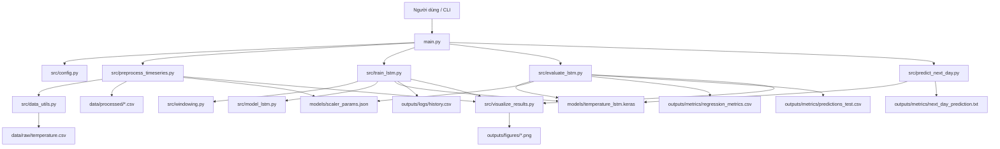
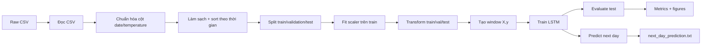
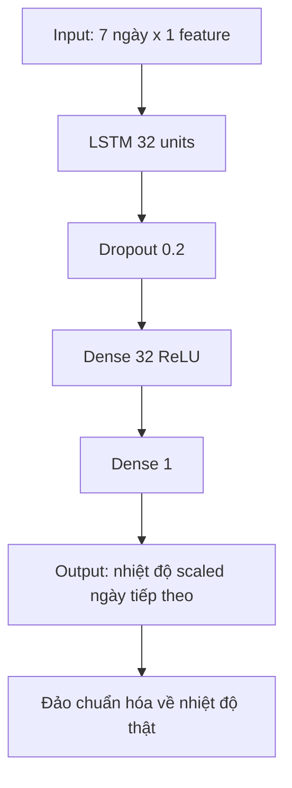
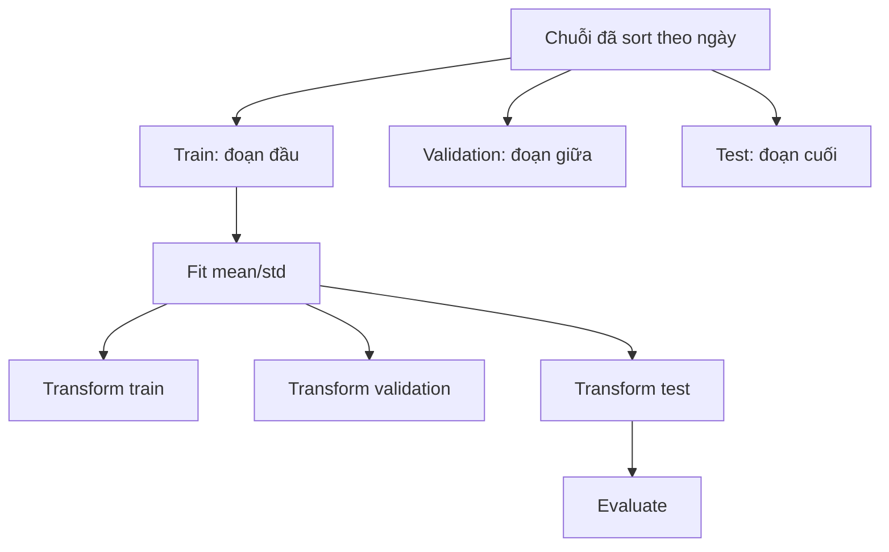

# Hồ sơ kiến trúc hệ thống `temperature_forecast`

Tài liệu này được tạo để đưa sang ChatGPT Web phân tích sâu kiến trúc hệ thống và dựng mô tả/ảnh kiến trúc pipeline. Nội dung bên dưới bám theo source code hiện tại của repository, không thêm kết quả giả và không suy diễn metric ngoài code.

## 1. Tổng quan hệ thống

| Mục | Mô tả |
|---|---|
| Tên project | `temperature_forecast` |
| Bài toán | Dự đoán nhiệt độ ngày tiếp theo bằng LSTM |
| Kiểu dữ liệu | Chuỗi thời gian nhiệt độ dạng CSV |
| Input chính | `data/raw/temperature.csv` |
| Output chính | Nhiệt độ dự đoán cho ngày kế tiếp |
| Mô hình | LSTM hồi quy một giá trị với TensorFlow/Keras |
| Giao diện chạy | CLI qua `main.py` và `app_temperature_cli.py` |
| Nguyên tắc dữ liệu | Không shuffle chuỗi thời gian, scaler chỉ fit trên train |

Hệ thống được tổ chức theo pipeline:

```text
Raw CSV -> Chuẩn hóa schema -> Làm sạch chuỗi thời gian
        -> Chia train/validation/test theo thời gian
        -> Chuẩn hóa bằng mean/std của train
        -> Tạo window LSTM
        -> Huấn luyện LSTM
        -> Đánh giá test set
        -> Dự đoán ngày tiếp theo
        -> Lưu model, metric, hình ảnh, log
```

## 2. Cấu trúc source code hiện tại

```text
temperature_forecast/
  README.md
  requirements.txt
  main.py
  app_temperature_cli.py
  .gitignore
  data/
    raw/
      .gitkeep
      temperature.csv
    processed/
      .gitkeep
      temperature_clean.csv
      train_series.csv              # tạo sau preprocess mới
      val_series.csv                # tạo sau preprocess mới
      test_series.csv               # tạo sau preprocess mới
      temperature_train_scaled.csv  # artifact cũ vẫn tương thích
      temperature_val_scaled.csv    # artifact cũ vẫn tương thích
      temperature_test_scaled.csv   # artifact cũ vẫn tương thích
      temperature_scaled.csv
      split_info.json
  docs/
    architecture_source_for_chatgpt.md
  models/
    .gitkeep
    scaler_params.json
    temperature_lstm.keras          # tạo sau train
  outputs/
    figures/
      .gitkeep
      temperature_series.png
      training_loss_mae.png
      actual_vs_predicted.png
      residual_plot.png
    logs/
      .gitkeep
      history.csv
    metrics/
      .gitkeep
      regression_metrics.csv
      predictions_test.csv
      next_day_prediction.txt
  reports/
    01_data_profile/
    02_training/
    03_evaluation/
    final_report/
      cleanup_summary.md
      submission_checklist.md
      test_log.txt
  src/
    __init__.py
    config.py
    data_utils.py
    preprocess_timeseries.py
    windowing.py
    model_lstm.py
    train_lstm.py
    evaluate_lstm.py
    predict_next_day.py
    visualize_results.py
    check_processed_timeseries.py
  tests/
    .gitkeep
    sample_temperature.csv
    test_temperature_end_to_end.py
```

Ghi chú dọn dẹp:

- Các README nhỏ trong `data/raw/`, `data/processed/`, `models/`, `tests/` đã được gộp vào `README.md` và xóa để cấu trúc gọn hơn.
- `.venv/` là môi trường ảo cục bộ, đã được ignore trong `.gitignore`; không đưa vào kiến trúc nộp bài.
- `.gitkeep` được giữ để Git lưu các thư mục output khi chưa có file kết quả thật.

## 3. Kiến trúc theo lớp

### Layer 1 - CLI/Application Entry

**File:** `main.py`, `app_temperature_cli.py`

**Trách nhiệm:**

- Nhận lệnh từ người dùng.
- Kiểm tra file/thư mục bắt buộc.
- Gọi pipeline tương ứng.
- In lỗi rõ ràng khi thiếu dữ liệu, thiếu model hoặc thiếu thư viện.

**Lệnh hỗ trợ:**

```bash
python main.py self_test
python main.py preprocess
python main.py train
python main.py evaluate
python main.py predict_next_day
python main.py run_all
```

`run_all` chạy:

```text
preprocess -> train -> evaluate -> predict_next_day
```

**Hàm quan trọng:**

| Hàm | Vai trò |
|---|---|
| `build_parser()` | Định nghĩa CLI bằng argparse |
| `main()` | Điểm vào chính, bắt lỗi và trả mã trạng thái |
| `self_test()` | Kiểm tra cấu trúc project và import module |
| `preprocess()` | Gọi tiền xử lý |
| `train()` | Gọi huấn luyện |
| `evaluate()` | Gọi đánh giá |
| `predict_next_day()` | Gọi dự đoán ngày tiếp theo |
| `run_all()` | Chạy toàn pipeline |

### Layer 2 - Configuration

**File:** `src/config.py`

**Trách nhiệm:** gom toàn bộ đường dẫn và tham số để các module không hard-code.

Nhóm cấu hình chính:

| Nhóm | Hằng số tiêu biểu | Ý nghĩa |
|---|---|---|
| Root/data | `PROJECT_ROOT`, `DATA_DIR`, `RAW_DIR`, `PROCESSED_DIR` | Thư mục project và dữ liệu |
| Raw/processed | `RAW_CSV_PATH`, `CLEAN_CSV_PATH`, `TRAIN_CSV_PATH`, `VAL_CSV_PATH`, `TEST_CSV_PATH` | File dữ liệu đầu vào/đầu ra |
| Model/scaler | `MODEL_PATH`, `SCALER_PATH`, `SCALER_PARAMS_PATH` | Model LSTM và tham số chuẩn hóa |
| Output | `FIGURE_DIR`, `METRIC_DIR`, `LOG_DIR` | Nơi lưu hình, metric, history |
| Cột dữ liệu | `DATE_COL`, `TEMP_COL`, `SCALED_TEMP_COL` | Tên cột chuẩn |
| LSTM | `WINDOW_SIZE`, `HORIZON`, `LSTM_UNITS`, `BATCH_SIZE`, `EPOCHS`, `LEARNING_RATE` | Tham số mô hình và huấn luyện |

### Layer 3 - Data Input

**File:** `src/data_utils.py`

**Trách nhiệm:** đọc CSV thô và chuẩn hóa schema về `date`, `temperature`.

**Hỗ trợ input:**

- CSV thường: `date`, `temperature`
- NASA POWER: `YEAR`, `MO`, `DY`, `T2M`
- NASA POWER: `YEAR`, `DOY`, `T2M`
- File NASA có metadata header

**Hàm quan trọng:**

| Hàm | Input | Output | Ghi chú |
|---|---|---|---|
| `_detect_skiprows_for_nasa_csv()` | Path CSV | Số dòng bỏ qua | Tìm `-END HEADER-`, `YEAR,`, `DATE,` |
| `read_temperature_csv()` | `data/raw/temperature.csv` | DataFrame thô | Dùng Pandas |
| `standardize_temperature_columns()` | DataFrame thô | DataFrame `date`, `temperature` | Chuẩn hóa nhiều dạng schema |
| `validate_temperature_frame()` | DataFrame chuẩn | None hoặc lỗi | Kiểm tra cột, rỗng, ngày/nhiệt độ hợp lệ |
| `load_temperature_data()` | Path CSV | DataFrame chuẩn | Hàm chính cho preprocessing |
| `profile_temperature_data()` | DataFrame | Dict profile | Dùng cho báo cáo dữ liệu |

### Layer 4 - Preprocessing

**File:** `src/preprocess_timeseries.py`

**Trách nhiệm:**

- Ép kiểu ngày/nhiệt độ.
- Đổi `-999` thành missing.
- Bỏ dòng không có ngày hợp lệ.
- Gom trùng ngày bằng mean.
- Sắp xếp theo thời gian.
- Reindex theo ngày để chuỗi đều.
- Nội suy missing bằng `interpolate`.
- Chia train/validation/test theo thời gian.

**Hàm chính:**

| Hàm | Vai trò |
|---|---|
| `clean_temperature_timeseries()` | Làm sạch chuỗi nhiệt độ theo ngày |
| `split_by_time()` | Chia train/validation/test không shuffle |
| `build_split_info()` | Tạo metadata chia tập |
| `preprocess_temperature_pipeline()` | Chạy toàn bộ tiền xử lý và lưu artifact |

**Điểm phức tạp cần giải thích:**

- Dữ liệu chuỗi thời gian không được shuffle vì sẽ làm rò rỉ thông tin tương lai.
- `split_by_time()` sort theo `DATE_COL` rồi cắt train trước, validation giữa, test cuối.
- Nội suy được thực hiện trước split; nếu báo cáo yêu cầu chống leakage nghiêm ngặt, cần giải thích đây là bước làm sạch toàn chuỗi và có thể thay bằng phương pháp chỉ dùng quá khứ.

### Layer 5 - Scaling/Transformation

**File:** `src/preprocess_timeseries.py`

**Trách nhiệm:** chuẩn hóa nhiệt độ để LSTM học ổn định hơn.

Công thức:

```text
temperature_scaled = (temperature - mean_train) / std_train
```

Đảo chuẩn hóa:

```text
temperature = temperature_scaled * std_train + mean_train
```

**Hàm chính:**

| Hàm | Vai trò |
|---|---|
| `fit_temperature_scaler()` | Tính mean/std chỉ trên train |
| `transform_temperature()` | Chuẩn hóa một DataFrame |
| `inverse_transform_temperature()` | Đưa giá trị scaled về nhiệt độ thật |
| `scale_time_splits()` | Fit train, transform train/validation/test |
| `save_json()` | Lưu `split_info.json`, `scaler_params.json` |
| `load_scaler_params()` | Đọc scaler params |

**Chống rò rỉ dữ liệu:**

- Mean/std chỉ lấy từ train.
- Validation/test không được fit lại scaler.
- `scaler_params.json` dùng lại cho evaluate/predict.

### Layer 6 - Windowing

**File:** `src/windowing.py`

**Trách nhiệm:** biến chuỗi 1D thành bài toán supervised learning cho LSTM.

**Hàm chính:** `create_sequences(values, window_size=WINDOW_SIZE, horizon=HORIZON)`

Input:

```text
values = [t1, t2, t3, ..., tn]
```

Với `WINDOW_SIZE = 7`, `HORIZON = 1`:

```text
X[0] = [t1, t2, t3, t4, t5, t6, t7]
y[0] = t8

X[1] = [t2, t3, t4, t5, t6, t7, t8]
y[1] = t9
```

Shape:

```text
X: (samples, window_size, 1)
y: (samples, 1)
```

Điểm cần giải thích:

- Chiều cuối cùng `1` là số feature: chỉ có nhiệt độ.
- Window phải giữ nguyên thứ tự thời gian.
- Target là ngày tiếp theo sau cửa sổ, không dùng dữ liệu tương lai trong input.

### Layer 7 - Model LSTM

**File:** `src/model_lstm.py`

**Hàm chính:** `build_lstm_model(input_shape, units=LSTM_UNITS, learning_rate=LEARNING_RATE)`

Kiến trúc hiện tại:

```text
Input(shape=(WINDOW_SIZE, 1))
LSTM(units=LSTM_UNITS)
Dropout(0.2)
Dense(32, activation="relu")
Dense(1)
```

Compile:

```text
optimizer = Adam(learning_rate=LEARNING_RATE)
loss = "mse"
metrics = ["mae"]
```

Ý nghĩa từng lớp:

| Lớp | Vai trò |
|---|---|
| `Input(shape=(7, 1))` | Nhận 7 ngày gần nhất, mỗi ngày 1 giá trị nhiệt độ scaled |
| `LSTM(32)` | Học quan hệ theo thời gian trong cửa sổ nhiệt độ |
| `Dropout(0.2)` | Giảm overfitting bằng cách bỏ ngẫu nhiên một phần tín hiệu khi train |
| `Dense(32, relu)` | Học tổ hợp phi tuyến sau đặc trưng LSTM |
| `Dense(1)` | Xuất đúng một giá trị: nhiệt độ scaled của ngày tiếp theo |

Tại sao dùng LSTM:

- LSTM có bộ nhớ trạng thái, phù hợp chuỗi thời gian.
- Dữ liệu nhiệt độ có xu hướng phụ thuộc các ngày gần trước đó.
- Cửa sổ 7 ngày giúp mô hình học nhịp ngắn hạn theo tuần.

### Layer 8 - Training

**File:** `src/train_lstm.py`

**Hàm chính:** `train_lstm()`, alias `train_lstm_pipeline()`

Luồng xử lý:

1. Kiểm tra `train_series.csv`/`val_series.csv`; nếu chưa có thì dùng artifact cũ `temperature_train_scaled.csv`/`temperature_val_scaled.csv`.
2. Đọc `temperature_scaled`.
3. Tạo `X_train`, `y_train`, `X_val`, `y_val`.
4. Build model LSTM.
5. Train bằng `model.fit`.
6. Dùng callback:
   - `EarlyStopping(monitor="val_loss", patience=5, restore_best_weights=True)`
   - `ModelCheckpoint(MODEL_PATH, save_best_only=True)`
7. Lưu:
   - `models/temperature_lstm.keras`
   - `outputs/logs/history.csv`
   - `outputs/figures/training_loss_mae.png`

Điểm phức tạp:

- Validation được tạo từ tập validation theo thời gian, không random split.
- `ModelCheckpoint` giữ model tốt nhất theo `val_loss`.
- `EarlyStopping` giúp tránh train quá lâu/overfitting.

### Layer 9 - Evaluation

**File:** `src/evaluate_lstm.py`

**Hàm chính:** `evaluate_lstm()`, alias `evaluate_lstm_pipeline()`

Luồng xử lý:

1. Kiểm tra model `models/temperature_lstm.keras`.
2. Đọc test series.
3. Tạo window test.
4. `model.predict(X_test)` trả về nhiệt độ scaled.
5. Đảo chuẩn hóa `y_true` và `y_pred` về nhiệt độ thật.
6. Tính:
   - MAE
   - MSE
   - RMSE
7. Lưu:
   - `outputs/metrics/regression_metrics.csv`
   - `outputs/metrics/predictions_test.csv`
   - `outputs/figures/actual_vs_predicted.png`
   - `outputs/figures/residual_plot.png`

Hàm phụ:

| Hàm | Vai trò |
|---|---|
| `load_lstm_model()` | Nạp model Keras |
| `load_scaler_params()` | Đọc mean/std train |
| `inverse_scale_temperature()` | Đảo chuẩn hóa |
| `compute_regression_metrics()` | Tính MAE/MSE/RMSE |
| `build_prediction_dataframe()` | Tạo bảng ngày, thật, dự đoán, sai số |

### Layer 10 - Next-Day Prediction

**File:** `src/predict_next_day.py`

**Hàm chính:** `predict_next_day()`

Luồng xử lý:

1. Đọc `data/processed/temperature_clean.csv`.
2. Lấy `WINDOW_SIZE` ngày cuối cùng.
3. Chuẩn hóa bằng `mean/std` train trong `scaler_params.json`.
4. Reshape thành:

```text
(1, WINDOW_SIZE, 1)
```

5. Gọi `model.predict`.
6. Đảo chuẩn hóa về nhiệt độ thật.
7. Tính ngày dự đoán = ngày cuối cùng + 1.
8. In kết quả và lưu `outputs/metrics/next_day_prediction.txt`.

Điểm chống leakage:

- Chỉ dùng các ngày đã có trong dữ liệu.
- Không dùng giá trị mục tiêu tương lai.
- Dùng scaler đã fit từ train.

### Layer 11 - Visualization/Output

**File:** `src/visualize_results.py`

**Hàm vẽ biểu đồ:**

| Hàm | Output |
|---|---|
| `plot_temperature_series()` | `outputs/figures/temperature_series.png` |
| `plot_training_history()` | `outputs/figures/training_loss_mae.png` |
| `plot_actual_vs_predicted()` | `outputs/figures/actual_vs_predicted.png` |
| `plot_residuals()` | `outputs/figures/residual_plot.png` |

Các biểu đồ dùng Matplotlib, không dùng seaborn hoặc framework ngoài.

### Layer 12 - Test/Acceptance

**File:** `tests/test_temperature_end_to_end.py`

Test hiện tại không train model thật, mục tiêu là kiểm tra nhanh:

- Cấu trúc thư mục.
- `main.py self_test`.
- `app_temperature_cli.py self_test`.
- CLI từ chối command sai.
- Thông báo thiếu model rõ ràng.
- Windowing đúng shape.
- Model build được nếu môi trường có TensorFlow.
- Metric MAE/MSE/RMSE chạy với dữ liệu giả.
- Input dự đoán reshape đúng `(1, 7, 1)`.
- Không hard-code đường dẫn `C:\` hoặc `D:\` trong CLI.

## 4. Pipeline dữ liệu từng bước

| Bước | File/hàm xử lý | Input | Output | Điểm cần giải thích |
|---|---|---|---|---|
| 1 | Người dùng đặt file | `data/raw/temperature.csv` | Raw CSV | Dữ liệu gốc không sửa trực tiếp |
| 2 | `main.py preprocess` | CLI | Gọi `preprocess_temperature_pipeline()` | Điểm bắt đầu pipeline |
| 3 | `read_temperature_csv()` | Raw CSV | DataFrame thô | Tự detect metadata NASA |
| 4 | `standardize_temperature_columns()` | DataFrame thô | `date`, `temperature` | Hỗ trợ nhiều schema |
| 5 | `validate_temperature_frame()` | DataFrame chuẩn | Pass/error | Báo lỗi nếu thiếu cột |
| 6 | `clean_temperature_timeseries()` | DataFrame chuẩn | Chuỗi sạch | Ép kiểu, sort, xử lý missing |
| 7 | `split_by_time()` | Chuỗi sạch | train/validation/test | Không shuffle |
| 8 | `fit_temperature_scaler()` | Train | mean/std | Fit train only |
| 9 | `transform_temperature()` | Train/val/test | `temperature_scaled` | Dùng cùng scaler train |
| 10 | `create_sequences()` | Chuỗi scaled | X/y windows | Shape LSTM |
| 11 | `build_lstm_model()` | `input_shape=(7,1)` | Keras model | LSTM + Dense |
| 12 | `train_lstm()` | X/y train/val | Model/history/figure | Huấn luyện thật |
| 13 | `evaluate_lstm()` | Model + test | Metric/predictions | Test set only |
| 14 | `predict_next_day()` | Model + latest window | Next-day prediction | Không dùng tương lai |

## 5. Bảng ánh xạ file - chức năng

| File | Chức năng chính | Input | Output |
|---|---|---|---|
| `main.py` | Điều phối CLI | Command | Gọi pipeline |
| `app_temperature_cli.py` | Wrapper CLI | Command | Gọi `main.py` |
| `src/config.py` | Cấu hình | None | Constants |
| `src/data_utils.py` | Đọc/validate dữ liệu | Raw CSV | DataFrame chuẩn |
| `src/preprocess_timeseries.py` | Làm sạch/split/scale | DataFrame | Processed CSV/JSON |
| `src/windowing.py` | Tạo X/y | Chuỗi scaled | `(samples, 7, 1)`, `(samples, 1)` |
| `src/model_lstm.py` | Build model | `input_shape` | Keras model |
| `src/train_lstm.py` | Huấn luyện | Train/val windows | `.keras`, history, chart |
| `src/evaluate_lstm.py` | Đánh giá | Model + test | MAE/MSE/RMSE, predictions |
| `src/predict_next_day.py` | Dự đoán | Model + latest window | Text prediction |
| `src/visualize_results.py` | Vẽ biểu đồ | DataFrame/history | PNG figures |
| `src/check_processed_timeseries.py` | Kiểm tra artifact preprocess | Processed files | OK/error |
| `tests/test_temperature_end_to_end.py` | Kiểm thử nhẹ | Dummy/project files | OK/error |

## 6. Artifact mapping

| Artifact | Path | Tạo bởi | Dùng bởi |
|---|---|---|---|
| Raw CSV | `data/raw/temperature.csv` | Người dùng | Preprocess |
| Clean CSV | `data/processed/temperature_clean.csv` | Preprocess | Predict |
| Train CSV | `data/processed/train_series.csv` | Preprocess | Train |
| Validation CSV | `data/processed/val_series.csv` | Preprocess | Train |
| Test CSV | `data/processed/test_series.csv` | Preprocess | Evaluate |
| Split info | `data/processed/split_info.json` | Preprocess | Kiểm tra/báo cáo |
| Scaler params | `models/scaler_params.json` | Preprocess | Evaluate/Predict |
| Model | `models/temperature_lstm.keras` | Train | Evaluate/Predict |
| History | `outputs/logs/history.csv` | Train | Plot/report |
| Metrics | `outputs/metrics/regression_metrics.csv` | Evaluate | Report |
| Predictions | `outputs/metrics/predictions_test.csv` | Evaluate | Report/plot |
| Next-day result | `outputs/metrics/next_day_prediction.txt` | Predict | Report |
| Figures | `outputs/figures/*.png` | Preprocess/train/evaluate | Report |

## 7. Mermaid diagram cho ChatGPT Web

### 7.1 Kiến trúc tổng thể



### 7.2 Pipeline dữ liệu



### 7.3 Mô hình LSTM



### 7.4 Chống rò rỉ dữ liệu



## 8. Điểm phức tạp cần ChatGPT Web giải thích kỹ

1. **Chuỗi thời gian không được shuffle**  
   Nếu shuffle, model có thể học từ tương lai, khiến metric đẹp giả.

2. **Scaler chỉ fit trên train**  
   Validation/test phải dùng mean/std của train để tránh rò rỉ thống kê.

3. **Windowing biến time series thành supervised learning**  
   LSTM không nhận toàn bộ DataFrame trực tiếp mà nhận tensor 3D `(samples, timesteps, features)`.

4. **Mô hình dự đoán giá trị đã chuẩn hóa**  
   Output của model là nhiệt độ scaled, cần đảo chuẩn hóa để báo cáo nhiệt độ thật.

5. **Evaluate khác predict_next_day**  
   Evaluate dùng test set có nhãn thật để tính metric. Predict dùng cửa sổ cuối cùng để dự đoán tương lai chưa có nhãn.

6. **Interpolation trước split**  
   Đây là điểm cần giải thích cẩn thận. Code hiện tại làm sạch toàn chuỗi trước khi split. Với yêu cầu chống leakage nghiêm ngặt, có thể cân nhắc impute sau split hoặc dùng forward-fill.

7. **Artifact cũ và mới cùng tồn tại**  
   Code mới tạo `train_series.csv`, `val_series.csv`, `test_series.csv`, nhưng vẫn tương thích artifact cũ `temperature_train_scaled.csv`, `temperature_val_scaled.csv`, `temperature_test_scaled.csv`.

## 9. Gợi ý cho ChatGPT Web khi viết báo cáo kiến trúc

Khi dùng tài liệu này trong ChatGPT Web, nên yêu cầu:

- Vẽ kiến trúc theo 4 khối lớn: Input/Preprocessing, Model Training, Evaluation, Prediction/Output.
- Giải thích kỹ shape dữ liệu trước và sau windowing.
- Giải thích LSTM layer theo ngữ cảnh chuỗi nhiệt độ.
- Nhấn mạnh chống rò rỉ dữ liệu: chronological split và train-only scaler.
- Không ghi metric cụ thể nếu chưa có file `regression_metrics.csv` từ chạy thật.
- Ghi rõ model chỉ dự đoán một giá trị nhiệt độ ngày tiếp theo.

## 10. Tóm tắt ngắn

`temperature_forecast` là hệ thống CLI dự đoán nhiệt độ ngày tiếp theo bằng LSTM. Kiến trúc được chia thành các lớp: CLI, config, data input, preprocessing, scaling, windowing, model, training, evaluation, prediction, visualization và tests. Dữ liệu đi từ `data/raw/temperature.csv`, được làm sạch và chia theo thời gian, chuẩn hóa bằng train scaler, chuyển thành cửa sổ LSTM, huấn luyện model, đánh giá bằng MAE/MSE/RMSE và dự đoán ngày tiếp theo từ cửa sổ mới nhất.
